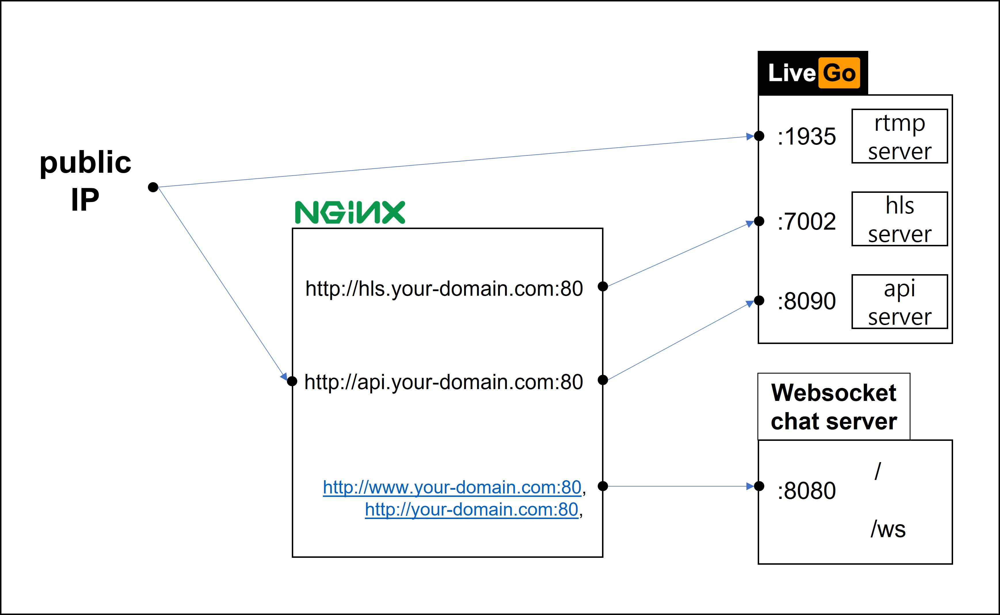

# live-streaming-example

실시간 방송 예제입니다.

## 구조

- 

## 설명

- [livego](https://github.com/gwuhaolin/livego)를 이용하여 송출자 -> rtmp -> livego server -> hls -> 수신자로 전달하는 서버를 실행합니다.
- [gorilla websocket chat tutorial](https://github.com/gorilla/websocket/tree/master/examples/chat)을 수정하여 만든 실시간 채팅 서버를 실행합니다.
- 실시간 채팅 서버의 엔드포인트를 따서 실시간 방송을 수신할 수 있는 페이지를 라우팅합니다.
- http 프로토콜의 경우, 도메인을 사용할 수 있도록 nginx 프록시 서버를 사용합니다.

## 실행

- 단순 실행 명령

  - ```bash
      # 실시간 채팅 서버 실행
      go run main.go

      # livego 채팅 서버 실행
      cd livego
      go run main.go
    ```

- 백그라운드 실행 명령

  - ```bash
      # 실시간 채팅 서버 백그라운드 실행
      go build -o live-streaming-example
      nohup ./live-streaming-example &

      # livego 채팅 서버 백그라운드 실행
      cd livego
      go build -o livego
      nohup ./livego &

      # 실시간 로그 확인(종료는 Ctrl + c)
      nohup -f nohup.out

      # 백그라운드 프로세스 종료
      # 아래 명령으로 빌드 파일의 프로세스 아이디를 알아내어 종료
      ps aux | grep [build file name]
      kill -9 [pid]
    ```

## nginx 설정

- 설정파일

  - ```bash
      # /etc/nginx/sites-available/my-config
      server {
          listen 80;
          server_name www.your-domain.com,your-domain.com;
          location / {
              proxy_pass http://127.0.0.1:8080;
              proxy_http_version 1.1;
              proxy_set_header Upgrade $http_upgrade;
              proxy_set_header Connection "upgrade";
              proxy_set_header Host $host;
              proxy_pass_request_headers      on;
          }
      }

      server {
          listen 80;
          server_name hls.your-domain.com;
          location / {
              proxy_pass http://127.0.0.1:7002;
              proxy_pass_request_headers      on;
          }
      }

      server {
          listen 80;
          server_name api.your-domain.com;
          location / {
              proxy_pass http://127.0.0.1:8090;
              proxy_pass_request_headers      on;
          }
      }
    ```

- 적용
  - ```bash
      # ubuntu 기준
      sudo ln -s /etc/nginx/sites-available/my-config /etc/nginx/sites-enabled/
      sudo systemctl stop nginx.service
      sudo system start nginx.service
    ```

## 서브모듈 다운로드

- 설명
  - livego 서브모듈을 업데이트합니다.
- 멍령
  - ```bash
      git submodule init
      git submoudle update
    ```

## 허용해야하는 포트

- 설명
  - 배포 시 클라우드 서비스 제공자를 이용 중이라면 보안규칙에서 인바운드 룰을 수정하여  
    일부 포트를 모든 곳에서 접근할 수 있도록 설정해야합니다.
- 허용해야하는 포트
  - tcp / 1935 / 0.0.0.0
  - tcp / 80 / 0.0.0.0
  - tcp / 443 / 0.0.0.0

## 주요 참고

- [livego](https://github.com/gwuhaolin/livego)
- [gorilla websocket chat tutorial](https://github.com/gorilla/websocket/tree/master/examples/chat)
